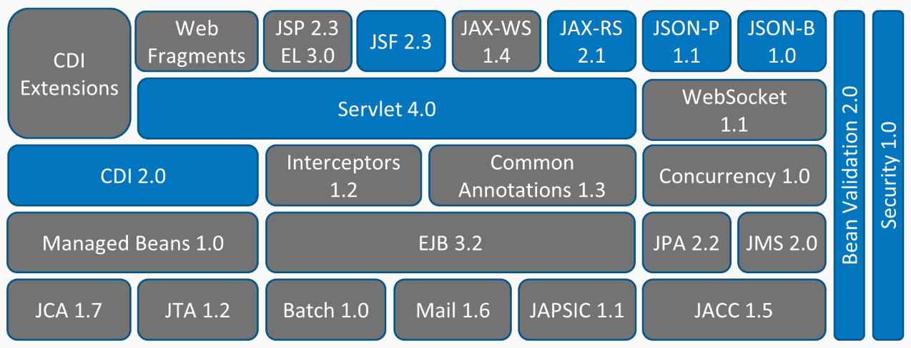

= Wildfly, Quarkus og brugen af specifikationer (Java EE 8)
Michael Bornholdt Nielsen michaelbornholdtnielsen@gmail.com
:toc:
:toc-title: Hvad skal jeg tale om 

== Wildfly

https://wildfly.org/[Wildfly]

- JBoss EAP 7.1 (Wildfly 14)
- Java EE 8
- Jakarta EE 8
- Moduler
- beans.xml

== Microprofile

https://microprofile.io/[Microprofile]

image::images/mp.png[Eclipse MicroProfile 3.2 is Now Available]

https://microprofile.io/2019/11/11/eclipse-microprofile-3-2-is-now-available/[Eclipse MicroProfile 3.2 is Now Available]

== Quarkus

*Supersonic Subatomic Java*

A Kubernetes Native Java stack tailored for OpenJDK HotSpot and GraalVM, crafted from the best of breed Java libraries and standards.

image::images/quarkus.png[Quarkus]

https://quarkus.io/[Quarkus]

https://www.graalvm.org/[GraalVM]

Dependency Injection

- https://quarkus.io/guides/cdi-reference[Quarkus - Contexts and Dependency Injection]
- https://weld.cdi-spec.org/[Weld] 
- beans.xml vs. annotations

=== Extensions

- Sammenligning med Wildflys moduler
- https://code.quarkus.io/[Quarkus - Start coding with code.quarkus.io]

=== Maven

[source,bash]
----
./mvnw compile quarkus:dev
----

[source,bash]
----
./mvnw clean package
java -jar target/quarkus-fagligfredag-demo-0.0.1-SNAPSHOT-runner.jar
----

[source,bash]
----
./mvnw package -Pnative
./target/quarkus-fagligfredag-demo-0.0.1-SNAPSHOT-runner
----

== ToDo gennemgang

Dette bliver en introduktion til https://quarkus.io/[Quarkus] med udgangspunkt i en simpel ToDo applikation.

Vi ser på hvordan kode skrevet til Java EE 8 specifikation, kan laves om til Quarkus.

Vi vil se på disse punkter i gennemgangen

-   Konfiguration af applikationen
-   Rest service
-   Persistering af data i database (PostgreSQL) med JPA (Hibernate)
-   Tilføj sikkerhed til applikationen
-   Tilføj Health
-   Tilføj Metrics
-   Tilføj OpenAPI (swagger)

Applikationen afvikler vi med https://quarkus.io/[Quarkus] og https://wildfly.org/[Wildfly].

Koden vil blive startet fra

- Terminal
- Docker
- Kubernetes (minikube)

=== MicroProfile Config

PingResource

[source,java]
----

@ConfigProperty(name = "pingMessage", defaultValue = "pingMessage need config..")
----

- ENV
- Propeties

=== JAX-RS

[source,java]
----
@Path("todos")
@Consumes(MediaType.APPLICATION_JSON)
@Produces(MediaType.APPLICATION_JSON)
----

=== Persistering af data

Hibernate

[source,java]
----

@Inject
EntityManager entityManager;
----

*Wildfly* - persistence.xml
[source,xml]
----
<persistence xmlns="http://xmlns.jcp.org/xml/ns/persistence"
	xmlns:xsi="http://www.w3.org/2001/XMLSchema-instance"
	xsi:schemaLocation="http://xmlns.jcp.org/xml/ns/persistence
    http://xmlns.jcp.org/xml/ns/persistence/persistence_2_1.xsd"
	version="2.1">

	<persistence-unit name="ToDoPU" transaction-type="JTA">
		<description>My ToDo entities</description>
 		<jta-data-source>jboss/datasources/ToDoDS</jta-data-source>
		<properties>
			<property name="hibernate.dialect" 
				value="org.hibernate.dialect.PostgreSQL95Dialect" />
			<property name="hibernate.show_sql" 
				value="false" />
			<property name="hibernate.format_sql" 
				value="true" />
			<property name="javax.persistence.schema-generation.database.action" 
				value="drop-and-create" />
			<property name="javax.persistence.validation.mode" 
				value="NONE" />
		</properties>
	</persistence-unit>

</persistence>
----

*Quarkus* - application.properties
----
quarkus.datasource.url=jdbc:postgresql://PostgreSQLDemo:5432/hibernate_db
quarkus.datasource.driver=org.postgresql.Driver
quarkus.datasource.username=hibernate
quarkus.datasource.password=hibernate
quarkus.datasource.max-size=8
quarkus.datasource.min-size=2
quarkus.hibernate-orm.database.generation=drop-and-create
quarkus.hibernate-orm.log.sql=false
----

=== Sikkerhed

[source,java]
----
@Inject
Principal principal;
----

[source,java]
----
@Inject
JsonWebToken jwt;
----

[source,bash]
----

export TOKEN="eyJraWQiOiIvcHJpdmF0ZUtleS5wZW0iLCJ0eXAiOiJKV1QiLCJhbGciOiJSUzI1NiJ9.eyJpc3MiOiJodHRwczovL3F1YXJrdXMuaW8vdXNpbmctand0LXJiYWMiLCJqdGkiOiJhLTEyMyIsInN1YiI6Im1pY2JuLXVzaW5nLWp3dC1yYmFjIiwidXBuIjoibWljYm5AcmVkcGlsbC1saW5wcm8uY29tIiwicHJlZmVycmVkX3VzZXJuYW1lIjoibWljYm4iLCJhdWQiOiJ1c2luZy1qd3QtcmJhYyIsImJpcnRoZGF0ZSI6IjIwMDEtMDctMTMiLCJyb2xlTWFwcGluZ3MiOnsiZ3JvdXAxIjoiR3JvdXAxTWFwcGVkUm9sZSIsImdyb3VwMiI6Ikdyb3VwMk1hcHBlZFJvbGUifSwiZ3JvdXBzIjpbIkVjaG9lciIsIlRlc3RlciIsIlN1YnNjcmliZXIiLCJncm91cDIiLCJ1c2VyIl0sImlhdCI6MTU3NjM0MTk2OSwiYXV0aF90aW1lIjoiTnVtZXJpY0RhdGV7MTU3NjM0MTk2OSAtPiAxNC1EZWMtMjAxOSAxNzo0NjowOSBDRVR9IiwiZXhwIjoxNTc2MzQyMjY5fQ.FYGtGIT_iU2hEF2F_XvjMXyCzCD7_Q4UXpNwhRJhpbRTqhFOeqQ-1yJllr6xs1oXH7OdRNovmqXjVZp3NEARwF7we-bm_h1TFPOQECeHGl8jvE7Ig9Cx0wL0QDxCUQKLQ1pOa9RSwy-_BkkJ0d3Nukn-Q871a6wm34syIWYB10KWWnm9CBRpeTRkA9YO-_xNhFqkmeDSkUfdHvoRbXbHEgg_TtB3_IOJp1xtC5xmrytm0Q-CmwdxnpHwAPfgVCJLPqg2bI_20_ESkKvLeMkFWTV3ReHSr4GNkEWOAcmCCajP9kizvftoPO2WyB0AkcdgzPLgW4_5D6Sd3L64ER8S9Q"

curl -v http://localhost:8080/todos \
	-H 'Accept: application/json' \
	-H 'Authorization: Bearer '$TOKEN'' \
	-H 'Content-Type: application/json' \
	-d '{"subject":"Hello from Quarkus","body":"Content","priority": 1,"importens": 10,"owner" : "Duke"}'
----

=== MicroProfile Health

----
@Health
----

[source,bash]
----
curl -X GET \
	http://localhost:8080/health \
	-H 'Accept: application/json' 
----

https://quarkus.io/guides/health-guide[quarkus.io - Health Guide]

=== MicroProfile Metrics

[source,bash]
----
curl -X GET \
	http://localhost:8080/metrics/application \
	-H 'Accept: application/json' 
----

https://quarkus.io/guides/metrics-guide[quarkus.io - Metrics Guide]

=== OpenAPI and SwaggerUI

Just add `quarkus-smallrye-openapi` as a dependency in `pom.xml` and https://en.wikipedia.org/wiki/Bob%27s_your_uncle[Bob is your uncle].

[source,xml]
----
<dependency>
	<groupId>io.quarkus</groupId>
	<artifactId>quarkus-smallrye-openapi</artifactId>
</dependency>
----

- http://localhost:8080/openapi[OpenAPI]
- http://localhost:8080/swagger-ui[swagger-ui]

OpenAPI and Swagger-UI only works in dev and test mode. 

[source,bash]
----
./mvnw compile quarkus:dev
----

https://quarkus.io/guides/openapi-swaggerui-guide[quarkus.io - OpenAPI SwaggerUI Guide]

== Bookstore gennemgang

=== Author JAX-RX + service

=== Book JAX-RX + extends PanacheEntity

=== Publisher RestController/RequestMapping (Spring) + service

=== Test @QuarkusTest

== Appendix

[source,bash]
----

export TOKEN="eyJraWQiOiIvcHJpdmF0ZUtleS5wZW0iLCJ0eXAiOiJKV1QiLCJhbGciOiJSUzI1NiJ9.eyJpc3MiOiJodHRwczovL3F1YXJrdXMuaW8vdXNpbmctand0LXJiYWMiLCJqdGkiOiJhLTEyMyIsInN1YiI6Im1pY2JuLXVzaW5nLWp3dC1yYmFjIiwidXBuIjoibWljYm5AcmVkcGlsbC1saW5wcm8uY29tIiwicHJlZmVycmVkX3VzZXJuYW1lIjoibWljYm4iLCJhdWQiOiJ1c2luZy1qd3QtcmJhYyIsImJpcnRoZGF0ZSI6IjIwMDEtMDctMTMiLCJyb2xlTWFwcGluZ3MiOnsiZ3JvdXAxIjoiR3JvdXAxTWFwcGVkUm9sZSIsImdyb3VwMiI6Ikdyb3VwMk1hcHBlZFJvbGUifSwiZ3JvdXBzIjpbIkVjaG9lciIsIlRlc3RlciIsIlN1YnNjcmliZXIiLCJncm91cDIiLCJ1c2VyIl0sImlhdCI6MTU3NjYwNjM5NiwiYXV0aF90aW1lIjoiTnVtZXJpY0RhdGV7MTU3NjYwNjM5NiAtPiAxNy1EZWMtMjAxOSAxOToxMzoxNiBDRVR9IiwiZXhwIjoxNTc2NjA2Njk2fQ.JTgLJ7hZbkorNEg0OTyNPNAQ8_7v23ElXX2oZNBWF-19I6k0BcnIPnydHs4Dylj3JsFtgeWSvhniv4dcEwBGphqLWKor_hG305Xv5YDiWvj0o-9xhhEDALRvO5ycjXwt69E8YN-YA-GdYgLyLhStSUZFjN3vMWQTO2U9UaO8jLcwZ239Z7rtw5XFy3vC9TxvDlGaPOiyBJSwagpi2oqIcdvlTHW6pB-J3lM0B5gheHlM2btHYnqFKsviCI5Jvo9TziM8Zm1rPi4xq0yZn8Es5zVLMvrOpji5pqlCC3TkSKSomnRCC3NFKLmxGCYYM_m9KRJWGbJCsmACY30ptM6o2A"

curl -v http://localhost:8080/todos \
	-H 'Accept: application/json' \
	-H 'Authorization: Bearer '$TOKEN'' \
	-H 'Content-Type: application/json' \
	-d '{"subject":"Hello from Quarkus","body":"Content","priority": 1,"importens": 10,"owner" : "Duke"}'

curl -v http://localhost:8080/todos \
	-H 'Accept: application/json' \
	-H 'Authorization: Bearer '$TOKEN'' \
	-H 'Content-Type: application/json' \
	-d '{"subject":"Hello from Quarkus 2","body":"Content 2","priority": 1,"importens": 10,"owner" : "Duke"}'	
----

[source,bash]
----
docker network inspect demo-net
----

[source,bash]
----
docker network create demo-net
----

[source,bash]
----
docker run --ulimit memlock=-1:-1 \
	-it --rm=true --memory-swappiness=0 \
	--name PostgreSQLDemo \
	--network demo-net \
	-e POSTGRES_USER=hibernate \
	-e POSTGRES_PASSWORD=hibernate \
	-e POSTGRES_DB=hibernate_db \
	-p 5432:5432 postgres:10.5
----

[source,bash]
----
docker build -f src/main/docker/Dockerfile.native -t quarkus-fagligfredag-demo .
----

[source,bash]
----
docker run -i --rm --name quarkus-fagligfredag --network demo-net -p 8080:8080 quarkus-fagligfredag-demo
----

Start postgres på minikube.

[source,bash]
----
kubectl run postgresqldemo \
	--image=postgres:10.5 \
	--port=5432 \
	--env=POSTGRES_USER=hibernate \
	--env=POSTGRES_PASSWORD=hibernate \
	--env=POSTGRES_DB=hibernate_db \
	--image-pull-policy=IfNotPresent

kubectl expose deployment postgresqldemo --type=NodePort
----

Start quarkus-fagligfredag-demo på minikube.

[source,bash]
----
kubectl run quarkus-fagligfredag-demo \
	--port=8080 \
	--image=quarkus-fagligfredag-demo:latest \
	--image-pull-policy=IfNotPresent

kubectl expose deployment quarkus-fagligfredag-demo --type=LoadBalancer	--name=quarkus-fagligfredag-demo-service
----

[source,bash]
----
kubectl get all
----

[source,bash]
----
kubectl delete deployment.apps/quarkus-fagligfredag-demo
----

[source,bash]
----
minikube dashboard --url
minikube service pgadmin --url
minikube service postgresqldemo --url
minikube service quarkus-fagligfredag-demo-service --url
----

[source,bash]
----
eval $(minikube docker-env)
----

[source,bash]
----
eval $(minikube docker-env -u)
----
